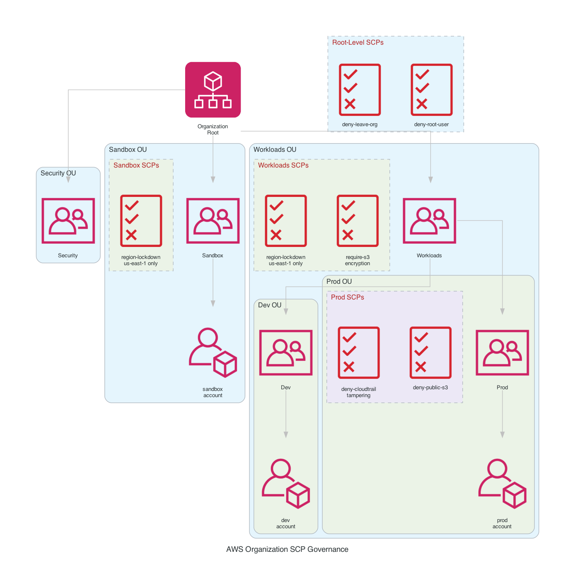

# AWS Organization SCP Governance

Multi-account AWS Organization with a five-OU hierarchy and six Service Control Policies enforcing least-privilege guardrails at every level. SCPs are layered so child OUs inherit parent restrictions automatically, and the management account is exempt by design, matching how AWS evaluates SCPs in production. Three member accounts across Sandbox, Dev, and Prod OUs validate that each policy blocks what it should. All infrastructure provisioned in Terraform with an S3 remote backend, deployed via GitHub Actions OIDC.

## Architecture



## OU Hierarchy

```
Root
├── Security OU
├── Sandbox OU ─── sandbox account
└── Workloads OU
    ├── Dev OU ─── dev account
    └── Prod OU ── prod account
```

## SCP Policy Library

| Policy | Attached To | What It Enforces |
|---|---|---|
| `deny-leave-org` | Root | Prevents any member account from calling `organizations:LeaveOrganization` |
| `deny-root-user` | Root | Blocks all API actions by the root user in member accounts |
| `region-lockdown` | Sandbox OU, Workloads OU | Denies all regional API calls outside `us-east-1`, with exceptions for global services (IAM, STS, Route 53, CloudFront, Organizations, etc.) |
| `require-s3-encryption` | Workloads OU | Denies `s3:PutObject` when the server-side encryption header is missing or set to anything other than AES256 or aws:kms |
| `deny-cloudtrail-tampering` | Prod OU | Denies `cloudtrail:StopLogging`, `cloudtrail:DeleteTrail`, and `cloudtrail:PutEventSelectors` |
| `deny-public-s3` | Prod OU | Denies public bucket ACLs (`public-read`, `public-read-write`, `authenticated-read`) and prevents removal of the account-level S3 public access block |

## Effective Permissions by Account

SCPs are evaluated as the **intersection** of every policy from root down to the account. A child account's effective permissions can never exceed what any ancestor OU allows.

| Account | Effective Restrictions |
|---|---|
| **sandbox** | Cannot leave org, root user blocked, locked to us-east-1 |
| **dev** | Cannot leave org, root user blocked, locked to us-east-1, S3 uploads require encryption header |
| **prod** | Cannot leave org, root user blocked, locked to us-east-1, S3 uploads require encryption header, cannot tamper with CloudTrail, cannot set public S3 ACLs or remove public access block |
| **management** | No SCP restrictions (exempt by design) |

## Deploy

```bash
aws configure  # or use OIDC via GitHub Actions

cd terraform
terraform init
terraform apply -var="org_email_domain=you@example.com"
```

The `org_email_domain` variable generates unique member account emails using `+` aliases (e.g., `you+sandbox@example.com`, `you+dev@example.com`, `you+prod@example.com`).

## Validate

The `validate.sh` script runs a seven-step end-to-end check: verifies the OU hierarchy structure, confirms all six SCPs are attached to the correct OUs, validates member account placement, assumes the `OrganizationAccountAccessRole` into each member account to test that denied actions return `AccessDenied`, and confirms the management account is SCP-exempt.

```bash
bash validate.sh
```

```
[1/7] Verifying Organization Structure...
  PASS: Root has 3 top-level OUs (Security, Sandbox, Workloads)
  PASS: Workloads OU has 2 child OUs (Dev, Prod)

[2/7] Verifying SCP Attachments...
  PASS: deny-leave-org attached at root
  PASS: deny-root-user attached at root
  PASS: region-lockdown attached at Sandbox OU
  PASS: deny-cloudtrail-tampering attached at Prod OU
  PASS: deny-public-s3 attached at Prod OU

[3/7] Verifying Member Account Placement...
  PASS: Sandbox account is in Sandbox OU
  PASS: Dev account is in Dev OU
  PASS: Prod account is in Prod OU

[4/7] Testing Region Lockdown (Sandbox Account)...
  PASS: Sandbox: us-east-1 STS call allowed
  PASS: Sandbox: us-west-2 SNS call denied

[5/7] Testing Region Lockdown (Dev Account)...
  PASS: Dev: us-west-2 SNS call denied
  PASS: Dev: us-east-1 STS call allowed

[6/7] Testing CloudTrail Tampering Deny (Prod Account)...
  PASS: Prod: CloudTrail StopLogging denied
  PASS: Prod: CloudTrail DeleteTrail denied

[7/7] Testing Management Account SCP Exemption...
  PASS: Management account: us-west-2 call succeeds (SCP exempt)

VALIDATION COMPLETE
  Passed: 15
  Failed: 0
```

## Tear Down

```bash
cd terraform
terraform destroy -var="org_email_domain=you@example.com"
```

Member accounts are created with `close_on_deletion = true`, so `terraform destroy` initiates account closure automatically. The organization and all OUs are removed in the same operation.

## Infrastructure

| Resource | Count |
|---|---|
| AWS Organization | 1 |
| Organizational Units | 5 (Security, Sandbox, Workloads, Dev, Prod) |
| Service Control Policies | 6 |
| SCP Attachments | 7 (2 root + 1 Sandbox + 2 Workloads + 2 Prod) |
| Member Accounts | 3 (sandbox, dev, prod) |
| Terraform State | S3 backend |

## Key Concepts

- **SCPs are guardrails, not grants.** They set the maximum permission boundary. An SCP that allows EC2 does not grant EC2 access; it means IAM policies in that account *can* grant EC2 if they choose to.
- **Inheritance is intersection.** The effective boundary for an account is the intersection of every SCP from root down through each parent OU. A deny at any level in the chain wins.
- **Management account is always exempt.** SCPs attached at root or any OU never restrict the management account, even explicit denies. This is by AWS design, not a misconfiguration.
- **Deny always wins.** If any SCP in the chain denies an action, no IAM policy in the account can override it.
